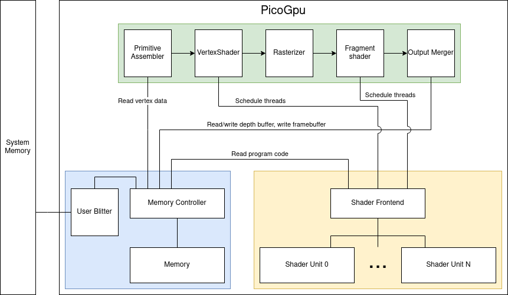

# PicoGpu
This project is an implementation of a simple GPU (*graphics processing unit*) using [SystemC](https://systemc.org/) environment. The GPU has its own memory allowing multiple components to utilize it. The rendering process is broken down into multiple hardware blocks performing specialized tasks and optionally using the memory.

It also contains programmable stages, which can be used to implement any graphics algorithm on the GPU side. More on *PicoGpu* shader programming can be found in [ShaderProgramming](ShaderProgramming.md).

In the following documentation the C++ code running inside *SystemC* processes will be referred to as *gpu-side* and the rest of the code will be referred to as *host-side*. Memory created on stack or heap is also considered *host-side* and has to be copied to *gpu-side* memory using blit operations.

# Architecture
*PicoGpu* consists of many internal blocks. Most of them have configurable parameters altering their behavior. The device exposes a set of configuration signals, which can be set by the host to configure the blocks. List of internal *PicoGpu* blocks:
- [CommandStreamer](gpu/blocks/command_streamer.h) (**CS**) - serves as a frontend for the host to interact with the GPU. Allows issuing drawcalls and blit operations.
- Memory section:
  - [Memory](gpu/blocks/memory.h) (**MEM**) - provides storage for various data required by the GPU, such as a vertex buffer or a frame buffer. 
  - [MemoryController](gpu/blocks/memory_controller.h) (**MEMCTL**) - serves as a frontend to *Memory* allowing multiple clients (i.e. blocks, like **PA** and **OM**) to access it in a safe manner.
  - [Blitter](gpu/blocks/blitter.h) (**BLT**) - performs memory transfers between host memory and GPU memory.
- Shader array:
  - [ShaderUnit](gpu/blocks/shader_array/shader_unit.h) (**SU**) - executes programmable shader threads and returns results of the computations.
  - [ShaderFrontend](gpu/blocks/shader_array/shader_frontend.h) (**SF**) - connects to multiple **SU**s and multiple programmable blocks in the graphics pipeline and arbitrates requests for launching threads.
- Graphics pipeline:
  - [PrimitiveAssembler](gpu/blocks/primitive_assembler.h) (**PA**) - reads vertex data from specified memory location and streams it to the next block in groups of 9 (three vertices with x,y,z components).
  - [VertexShader](gpu/blocks/vertex_shader.h) (**VS**) - schedules a programmable shader for execution to the **SF**. The shader receives vertex position and has to output transformed vertex position.
  - [Rasterizer](gpu/blocks/rasterizer.h) (**RS**) - iterates over all pixels in framebuffer and checks if they are inside triangles streamed from **VS**. Pixels that are inside, are then sent for fragment shading. Also performs perspective division.
  - [FragmentShader](gpu/blocks/fragment_shader.h) (**FS**) - schedules a programmable shader for execution to the **SF**. The shader receives interpolated vertex position and has to output 4-component RGBA color of a given pixel.
  - [Output Merger](gpu/blocks/output_merger.h) (**OM**) - writes color data to the framebuffer. Optionally performs a depth test.





# Repository structure
- [gpu](gpu) - static library containing all GPU functionality.
  - [blocks](gpu/blocks) - hardware blocks of the gpu.
  - [definitions](gpu/definitions) - utility functions and types specific to the *PicoGpu* project.
  - [isa](gpu/isa) - definition of instruction set architecture of *PicoGpu* and an assembler.
  - [util](gpu/util) - utility functions not strictly connected with the *PicoGpu* project.
- [gpu_tests](gpu_tests) - source code for executable tests of the Gpu library. Due to how SystemC works, each test is contained in a separate executable.
- [third_party](third_party) - dependencies of the *PicoGpu* project

# Features
Existing functionalities of *PicoGpu* worth noting:

| Feature                                      | Comment                                                                                                   |
| -------------------------------------------- | --------------------------------------------------------------------------------------------------------- |
| Rendering multiple triangles in one drawcall | **PA** iterates over triangles.                                                                           |
| VCD traces                                   | Traces are dumped in the binary directory.                                                                |
| Multi-client memory                          | **MEMCTL** arbitrates access of clients to memory.                                                        |
| Copying between host memory and GPU memory   | **BLT** performs memory transfers.                                                                        |
| Depth testing                                | **OM** performs depth test.                                                                               |
| Floating point data                          | Data flowing through 32-bit wide ports are assumed to be floating point by various blocks.                |
| Programmability                              | **SU** can execute *PicoGpu* ISA.                                                                         |
| Vertex shader                                | Launches threads via **SF**.                                                                              |
| Fragment shader                              | Launches threads via **SF**.                                                                              |
| Signals for profiling                        | All blocks have their own signal indicating, whether they are doing any work.                             |
| Unified frontend for launching tasks         | **CS** is the only block, which the host has to interact with.                                            |
| Barycentric coordinates calculation          | Special code is injected at the beginning of fragment shaders to calculate weights.                       |
| Uniform values                               | Shaders can define uniform register, which will be initialized to values set in pipeline state registers. |

Roadmap for features to implement:

| Feature                           | Comment                                                                                                                           |
| --------------------------------- | --------------------------------------------------------------------------------------------------------------------------------- |
| Optimize data passing             | Some blocks could use parallel ports for faster data passing.                                                                     |
| Better rasterization algorithm    | **RS** blindly iterates over every pixel.                                                                                         |
| Add a real-time visualization     | Currently we dump the framebuffer to a png file. We could attach it to an OpenGL window instead.                                  |
| Connect shader units to memory    | Add a separate MemoryController just for the shader units?                                                                        |
| Add matrix operations to the ISA  | Will have to use 4 subsequent register as a 4x4 matrix. Complicated range checking. Takes 12 out of 16 register to do anything... |
| Implement conditions in ISA       | Gets really complicated to handle thread divergence and operation masking.                                                        |

# Building and running
Requirements: Linux OS, SystemC environment, CMake and a C++ compiler.

Run all gpu tests:
```
mkdir -p build
cd build
cmake ..
make -j$(nproc)
ctest
```

Run *GpuTest* (tests the entire GPU instead of individual blocks)
```
./run_gpu.sh
```
