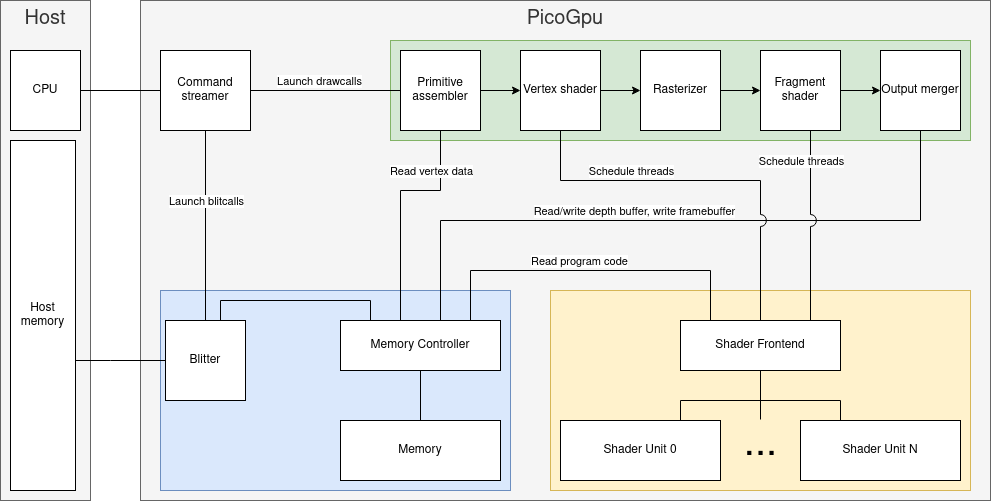

# PicoGpu
This project as an implementation of a simplified GPU using [SystemC](https://systemc.org/) environment. The GPU has its own memory allowing multiple clients to utilize it. The rendering process is broken down into multiple hardware blocks performing specialized tasks and optionally using the memory. Device is not programmable yet, it only allows some configuration.

# Architecture
*PicoGpu* instantiates all its internal blocks, defines signals and connects all the blocks together. Current list of internal blocks:
- [PrimitiveAssembler](gpu/blocks/primitive_assembler.h) (**PA**) - reads vertex data from specified memory location and streams it to the next block in groups of 9 (three vertices with x,y,z components).
- [Rasterizer](gpu/blocks/rasterizer.h) (**RS**) - iterates over all pixels in framebuffer and checks if they are inside triangles streamed from previous block. Pixels that are inside, are then sent to the next block along with their color. Currently the color is randomize per-triangle, so they are distinguishable. In the future color will be calculated by the fragment shader.
- [Output Merger](gpu/blocks/output_merger.h) (**OM**) - optionally performs the depth test and writes pixels to the framebuffer
- [User blitter](gpu/blocks/user_blitter.h) (**BLT**) - allows communicating between the *PicoGpu* and regular system memory (outside the simulation).
- [Memory](gpu/blocks/memory.h) (**MEM**) and [MemoryController](gpu/blocks/memory_controller.h) (**MEMCTL**) - provide storage for various data required by the GPU, such as a vertex buffer or a frame buffer. *MemoryController* is a frontend to *Memory* allowing multiple clients (i.e. blocks, like **PA** and **OM**) to access it in a safe manner. All other blocks in *PicoGpu* have to communicate with *Memory* through the *MemoryController*. There is no direct connection.




# Repository structure
- [gpu](gpu) - static library containing all GPU functionality.
  - [blocks](gpu/blocks) - hardware blocks of the gpu.
  - [util](gpu/util) - utility functions not strictly connected with the *PicoGpu* project.
- [gpu_tests](gpu_tests) - source code for executable tests of the Gpu library. Due to how SystemC works, each test is contained in a separate executable.
- [third_party](third_party) - dependencies of the *PicoGpu* project

# Features
The project is not very mature and it lacks many features. Existing functionalities as well as planned future improvements are presented in the table below
| Feature                                      | Status                                                                              |
|----------------------------------------------|-------------------------------------------------------------------------------------|
| Render a triangle                            | :heavy_check_mark:                                                                  |
| Create vcd trace of all signals              | :heavy_check_mark:                                                                  |
| Multi-client memory                          | :heavy_check_mark: `MemoryController` arbitrates access of clients to memory        |
| Read vertex data from memory                 | :heavy_check_mark:                                                                  |
| Render multiple triangles                    | :heavy_check_mark:                                                                  |
| Copying between system memory and GPU memory | :heavy_check_mark: Implemented `UserBlitter`                                        |
| Depth test                                   | :heavy_check_mark: `OutputMerger` performs depth test                               |
| Customizable vertex layout                   | :x: Currently only 3-component vertices can be passed.                              |
| Floating point data                          | :x: Currently all vertex data is 16-bit ints.                                       |
| Programmability                              | :x: Some unified frontend to scheduling threads by multiple clients will be needed. |
| Vertex shader                                | :x:                                                                                 |
| Fragment shader                              | :x:                                                                                 |
| Add a real-time visualization                | :x: Currently we dump the framebuffer to a png file                                 |


# Building and running
Requirements: Linux OS, SystemC environment, CMake and a C++ compiler.

Run all gpu tests:
```
mkdir -p build
cd build
cmake ..
make -j$(nproc)
ctest
```

Run *GpuTest* (tests the entire GPU instead of individual blocks)
```
./run_gpu.sh
```
